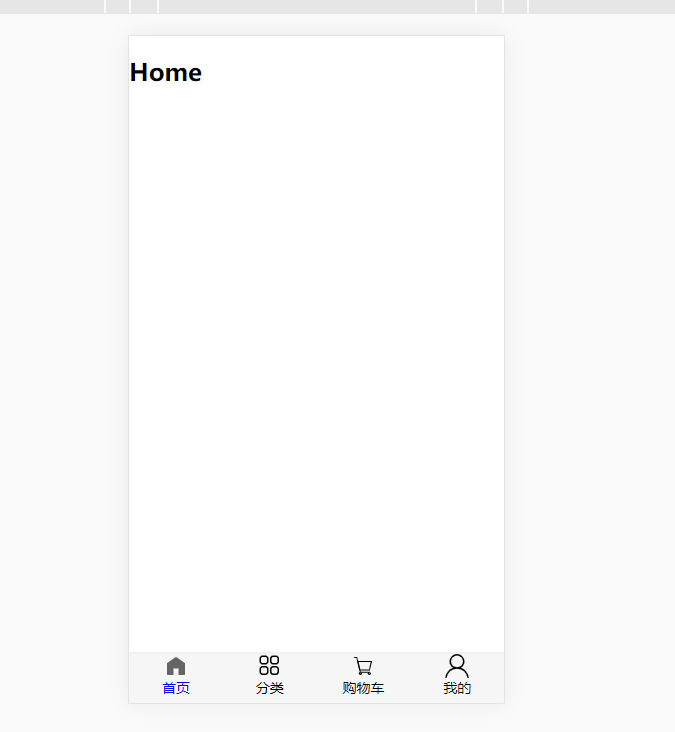

## 需求介绍

```
1,完成下图的整体设计
2,拆分模块,降低耦合
3,组件之间传递属性
4,使用路由进行组件跳转

详细:
	1.将底部tabbar封装成一个可复用类型的代码,使用插槽
	2.动态绑定点击之后的active属性,图标显示,
```



### 默认在已经创建后的Vue项目框架下

### 具体代码

####  一,设计底部模块最外层TabBar

```vue
// 在components文件下创建TabBar.vue文件
// TabBar.vue
// slot插槽占位,后续可自定义扩展自己想要的图标和内容
<template>
    <div id="tab-bar">
      <slot></slot>
    </div>
</template>

<script>
export default {
  name: '',
  components: {},
  data() {
    return {

    }
  }
}
</script>

<style scoped>
#tab-bar {
  display: flex;
  background-color: #f6f6f6;
  position: fixed;
  left: 0;
  right: 0;
  bottom: 0;

  box-shadow: 0 -2px 1px rgba(100, 100, 100, 0.1);
}


</style>

```

#### 二,设计内部TabBarItem

```vue
// 使用插槽定义图标,文字内容
// 外层div绑定点击事件,主要是为了改变文字属性和图标的显示
// 在slot外层套上div是为了防止slot被替换之后可能会少掉一些参数
// 最后动态的绑定了class 主要是因为这个active的属性是需要通过用户的点击来判断的
<template>
  <div class="tab-bar-item" @click="itemClick">
    <div v-if="isActive">
      <slot name="item-active-icon"></slot>
    </div>
    <div v-else>
      <slot name="item-deactive-icon"></slot>
    </div>
    <div :style='activeStyle'>
      <slot name="item-text"></slot>
    </div>
  </div>
</template>

<script>
export default {
  name: "TabBarItem",
  // 定义了props 可以后去父组件传递的数据
  props: {
    link: String,
    activeColor: {
      type: String,
      default: "green",
    },
  },
  components: {},
  data() {
    return {};
  },
  // 定义计算属性,将一些有复杂逻辑的内容整合
  computed: {
    isActive() {
      // 使用this.$route获取到当前处于激活的path,和父组件传递过来的link做比较
      return this.$route.path.indexOf(this.link) !== -1;
    },
    activeStyle() {
      // 三目运算判断当前是否处于激活状态
      return this.isActive ? { color: this.activeColor } : {};
    },
  },
  methods: {
    itemClick() {
      // 主要是做一个url的替换
      this.$router.replace(this.link);
    },
  },
};
</script>

<style scoped>
.tab-bar-item {
  flex: 1;
  text-align: center;
  height: 49px;
  font-size: 14px;
}
.tab-bar-item img {
  height: 24px;
  width: 24px;
  vertical-align: middle;
}
.active {
  color: red;
}
</style>

```

#### 定义各个视图

```
// 建议 在components 文件夹下建立views文件夹保存不同的视图函数
// 在对应视图文件中编写对应代码
/*
└─views
    ├─cart
    │      Cart.vue
    │
    ├─category
    │      Category.vue
    │
    ├─home
    │      Home.vue
    │
    └─profile
            Proflie.vue

*/

```

### 在APP.vue中使用这些组件

##### 目前这个比较简单 后续应该不在APP文件中使用

```vue
<template>
  <div id="app">
    // 这个router-view 记得要写 这样才能显示路由组件的内容
    <router-view></router-view>
    <tab-bar>
      //  直接在这些标签中写入的属性 会传递给子组件,子组件通过props接收到
      <tab-bar-item link='/home' activeColor='blue'>
        
        
        <div slot="item-text">首页</div>
      </tab-bar-item>

       <tab-bar-item link='/category' activeColor='blue'>
        
        
        <div slot="item-text">分类</div>
      </tab-bar-item>

       <tab-bar-item link='/cart' activeColor='blue'>
        
        
        <div slot="item-text">购物车</div>
      </tab-bar-item>

       <tab-bar-item link='profile' activeColor='blue'>
        
        
        <div slot="item-text">我的</div>
      </tab-bar-item>
    </tab-bar>
  </div>
</template>

<script>
import TabBar from "../src/components/tabbar/TabBar";
import TabBarItem from "../src/components/tabbar/TabBarItem"

export default {
  name: "App",
  data() {
    return {
    };
  },
  components: {
    TabBar,
    TabBarItem
  },
};
</script>

<style>

/* 这个分号可得记得写 */
@import "./assets/css/base";
</style>

```


